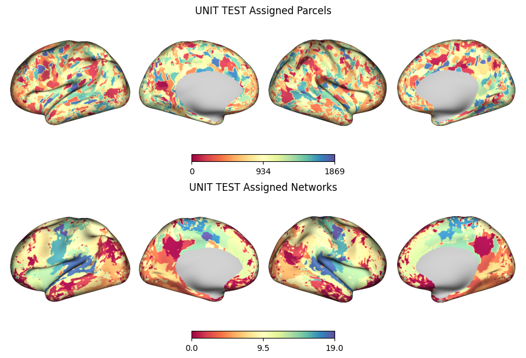

# Precision Mapping:
A python based individualized fMRI brain parcellation package based on [src *** ] in python with performance optimizations for reduced memory usage and gpu accelleration using block matrix math.

# Installation and Usage
Download git repo

```
git clone git@github.com:dsclab42/precision_mapping.git
```

Example Usage:
```
python precision_mapping/precision_mapping.py -c cifti1.dtseries.nii -s "SUBJECT01" -l "SUBJECT01_RUN1" -o output_dir/
```

Can also be imported as a package:

```
import precision_mapping as pm

pm.precision_mapping(dtseries_path, subject_id, sample_label, out_dir, overwrite=True)
```

# Example:
Outputs included parcellation and assigned brain network dlabels (`.dlabel.nii`):




# TODO:
## Shareable package todos:
	[] smoothing distance mask: check?
		[] failing
	[] add exclude cortex filters
	[] kmeans split number should be half per hemisphere
	[] add functions to calculate cortical area of networks

	[] update readme to show better use case
	[] update argparse --help
	[] make sure distance mask can use "None"


### minor todos:
	[] code comments
		[] function descs

	[] rename? - patchwork-PRF, splotch, patchwork, neuroparcel, brain_mapper, brainpatch,
		- kit, FC
	[] add citations!
	[] consider changing print path exists when lots of files already exist?

	[] change cmap colors for network parcel plot

	[] add parcellate func, which specifies parcellate method (infomaps, kmeans, etc)
		[] infomaps_parcellate would wrap sparse_vFC + infomaps
		[] kmeans_parcellate would just implement kmeans parcellating
		[] others?
