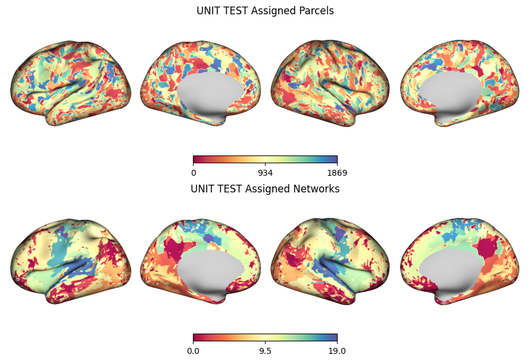

# Precision Mapping:
A python based individualized fMRI brain parcellation package with block matrix gpu acceleration

# Installation and Usage
Download git repo

```
git clone git@github.com:cole-khamnei/precision_mapping.git
```

Example Usage:
```
python precision_mapping/precision_mapping.py -c cifti1.dtseries.nii -s "SUBJECT01" -l "SUBJECT01_RUN1" -o output_dir/
```

Can also be imported as a package:

```
import precision_mapping as pm

ps = pm.precision_mapping(dtseries_path, subject_id, sample_label, out_dir, overwrite=True)
```

# Example:
Outputs included parcellation and assigned brain network dlabels (`.dlabel.nii`):




# TODO:
## Shareable package todos:
	[] add smoothing distance filter
		[] do you exclude connections that are within the kernel size?
			[] if yes, then can just pass the filter matrix I think


### minor todos:
	[] code comments
		[] function descs
